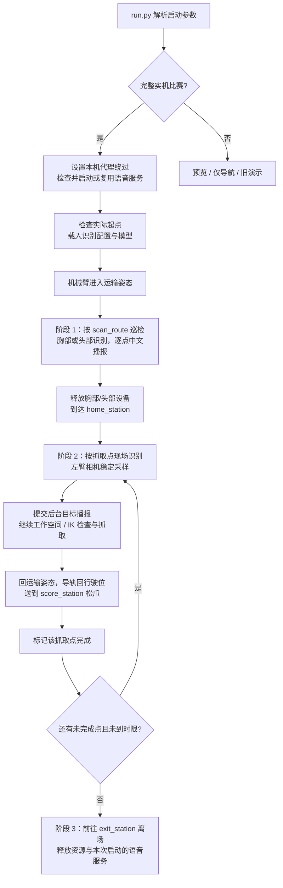

# RoboCup Embodied Robot

用于 RoboCup 场景的 Python 机器人项目：按照提前打好的 LM 点完成全图物品识别与中文播报，再使用左臂相机重新定位、抓取和运送物品，最后自主离场。

默认比赛入口是 `run.py`。完整任务采用“先扫描识别，再现场抓取”的两阶段策略，支持按点位切换胸部/头部相机、按抓取高度切换导轨与机械臂观察姿态，以及采样完成后的后台语音播报。

本文根据 **2026-10-03 的项目代码与配置**整理。文中的 LM 点、网络地址和机械臂参数是当前配置快照；部署到另一台机器人前，请核对实物和地图。

## 1. 第一次阅读，先看这几项

| 要做什么 | 从哪里开始 |
|---|---|
| 查看流程，不运动机器人 | `python3 run.py` |
| 设置识别顺序、抓取顺序和出入口 | `config/task_config.json` 的 `competition` |
| 设置哪些点用胸部、哪些点用头部 | `config/recognition.yaml` 的两个 `stations` 列表 |
| 设置左臂相机、模型、手眼标定和抓取高度 | `config/perception.yaml` |
| 完整比赛，包括自动启动语音 | `python3 run.py --execute --confirm-calibration` |
| 单独查看胸部/头部画面 | `python3 -m tools.recognition_viewer --camera chest` |
| 排查语音或 IK | 见本文第 9、11、13 节 |

**配置分工：任务 JSON 管“走到哪里”，识别 YAML 管“用哪台相机”，抓取 YAML 管“如何定位与抓取”。**

新增几十处点位通常只需要修改配置。配置里写入一个 LM 名称不会在底盘地图中创建它，必须先在 RoboShop/底盘地图中完成建图和打点。

## 2. 当前比赛流程

### 2.1 三个阶段



默认比赛由 `app/main.py` 中的 `run_competition()`、`CompetitionScanner` 和抓取轮次循环编排。`common/state_machine.py` 提供通用状态机工具，但当前默认比赛入口没有调用这套 `StateMachine` 驱动流程；修改比赛阶段应先阅读 `app/main.py`。

### 2.2 当前点位和时间

| 项目 | 当前值 | 设置位置 |
|---|---|---|
| 起点 | `LM1` | `competition.start_station` |
| 扫描顺序 | `LM2 → LM3 → LM4 → LM5 → LM6` | `competition.scan_route` |
| 扫描结束后的内部停靠点 | `LM6` | `competition.home_station` |
| 第一轮抓取顺序 | `LM6 → LM5 → LM4 → LM3 → LM2` | `competition.grasp_priority` |
| 得分区释放点 | `LM7` | `competition.score_station` |
| 门外离场点 | `LM8` | `competition.exit_station` |
| 单点有效扫描时间 | 6 秒 | `--scan-seconds` |
| 任务总时长参数 | **600 秒** | `--match-seconds` |
| 抓取阶段搜索时间预算 | 8 秒 | `--grasp-timeout-seconds` |
| 锁定目标后的单次采样时间 | 20 秒 | `--grasp-sample-timeout-seconds` |
| 稳定三维采样数量 | 10 个 | `grasp_test.stable_samples` |

实际默认时长来自 `MATCH_SECONDS = 600.0`。部分旧日志、注释和 CLI 帮助仍写“480 秒/8 分钟”，不能用这些文字推断实际时限。若你们本场比赛要求 480 秒，可显式启动：

```bash
python3 run.py --execute --confirm-calibration --match-seconds 480
```

时限在阶段循环和新增动作前检查，不是随时抢占所有 SDK 调用的硬实时中断。当前已经开始的导航、采样、抓取、运返或离场仍可能花费额外时间；`--exit-reserve-seconds` 只为兼容旧参数保留，当前没有提前预留离场时间的效果。

单点 6 秒是相机启动与预热完成后的有效观察时间，不包含该点后续的阻塞播报时间。

### 2.3 抓取轮次与完成判定

- 第一轮使用 `grasp_priority`；后续轮次按 `scan_route` 中的抓取点顺序重试，只出现在抓取列表中的点补到末尾。
- 每次到达抓取点，都用左臂相机现场识别。扫描记录只作为提示，不会因第一阶段漏检而跳过现场识别。
- 一次成功抓取后，立即回得分区松爪，然后继续下一点。
- **只有得分区释放动作成功返回，才把来源点加入 `completed_stations`。该点本轮比赛以后永久跳过。**
- 搜索/采样超时会尝试换观察姿态或继续下一点；工作空间和 IK 安全拒绝会保留该点，后续再试。已发出运动指令后的 SDK 故障不按普通漏检处理。
- 未完成点完整巡检一轮，没有可抓目标且没有未确认点，或所有抓取点均已完成，会进入离场；到总时限则停止继续新增抓取，进入离场。

当前策略适合“每个抓取点成功取走一次即完成”的安排。**同一点位放有多件物品时，当前代码不会在第一次成功运返后继续清空该点。** 不同点位出现相同类别，可以分别识别、播报和抓取。

`delivered_count` 是程序完成抓取与得分区释放流程的计数。抓取返回中 `holding_verified` 仍为 `False`，没有独立传感器确认物品实际一直在夹爪中；程序计数不等于裁判实际得分。

当前得分区动作复用现有机械臂连接直接松爪，没有单独的“到放置姿态再放下”动作规划。得分点、运输姿态与物品落点需要一起实测确认。

## 3. 项目结构和分层

```text
robocup_embody/
├── run.py                         # 统一入口、语音服务生命周期
├── app/main.py                    # 比赛编排、扫描、抓取轮次、运返、离场
├── config/
│   ├── task_config.json           # 路线、导航网络、运输姿态、旧演示配置
│   ├── recognition.yaml           # 胸部/头部相机和识别点位分组
│   └── perception.yaml            # 模型、左臂相机、手眼标定、抓取高度与安全参数
├── modules/
│   ├── perception/                # 检测、相机切换、深度定位、手眼变换
│   ├── grasp/                     # 抓取动作与 RealMan SDK 适配
│   ├── navigation/                # Navigator、安全状态检查、AGV 协议
│   │   └── agv_api/               # 底盘通信实现
│   ├── hardware/
│   │   ├── mission_slide/         # 默认比赛使用的导轨适配和驱动
│   │   ├── slide_control/         # 其他导轨工具/旧接口，勿与默认路径混淆
│   │   ├── arm/                   # 通用机械臂/夹爪工具
│   │   ├── camera/                # 通用相机工具
│   │   └── head_control/          # 头部控制工具
│   ├── audio/                     # 比赛播报及保留的旧语音助手
│   └── reid/                      # ReID 工具，未接入默认比赛主流程
├── common/                        # 配置、状态机和通用工具
├── assets/models/                 # YOLO 权重
├── tools/                         # 自检、相机查看、语音测试、IK 诊断
├── tests/                         # 单元测试和使用替身设备的回归测试
├── docs/                          # 说明、验证记录与合入前备份
└── archive/                       # 历史副本，不是默认运行入口
```

关键职责对应如下：

| 层次 | 主要文件 | 职责 |
|---|---|---|
| 启动层 | `run.py` | 根据原参数决定是否启动语音；结束时清理自己启动的服务 |
| 任务层 | `app/main.py` | 决定去哪个点、何时识别/抓取/播报，以及如何运返和重试 |
| 识别配置层 | `recognition_config.py` | 校验点位分组，查询点位对应的相机 |
| 识别服务层 | `recognition_service.py`、`recognition_camera.py` | 第一阶段 RGB 类别确认、相机切换、画面与截图 |
| 抓取感知层 | `perception_pipeline.py`、`depth_localizer.py`、`handeye_transform.py` | 第二阶段深度定位、稳定性判断和坐标转换 |
| 抓取执行层 | `grasp_controller.py`、`realman_arm.py` | 工作空间/IK 检查、运动与夹爪 SDK 调用 |
| 导航层 | `navigation_adapter.py`、`agv_api/` | 通信、到站确认、受阻和取消处理 |
| 导轨层 | `modules/hardware/mission_slide/controller.py` | 根据高度档准备导轨，并回到行驶位 |
| 语音任务层 | `modules/audio/speech.py` | 中文名称、点位去重、重试、后台播报队列 |
| 音频工具层 | `modules/audio/speech_utils.py` | 合成客户端、缓存、播放器、服务启动与清理 |
| 语音服务层 | `modules/audio/chat.py` | 本地 HTTP 合成接口和只读健康接口 |

旧 ASR、麦克风、门铃和 `voice_assiant.py` 仍保留，但默认物品播报不需要启动它们。不要为修改物品名称而整体替换或删除 `audio` 目录。

## 4. 运行环境与首次安装

### 4.1 环境要求

项目提供 Ubuntu 22.04、Python 3.10 的 CPU 依赖基线。机器人比赛使用 Linux；Windows 上的代码检查和替身测试不能代替 Linux 驱动与实机验证。

| 依赖 | 用途 |
|---|---|
| NumPy、OpenCV、Pillow、PyYAML | 数值、画面、中文标注、YAML 配置 |
| PyTorch、torchvision、Ultralytics | YOLO 模型推理 |
| `pyrealsense2` | RealSense 相机取流与深度反投影 |
| `Robotic_Arm` | RealMan API2 与对应本机动态库 |
| `pyserial` | 导轨串口 |
| `edge-tts`、FastAPI、Uvicorn | 物品语音合成服务 |
| 系统 `mpg123` | Linux MP3 播放 |

`requirements-ubuntu22.txt` 固定了视觉/硬件基线版本，例如 `ultralytics==8.3.203`、`torch==2.6.0`、`torchvision==0.21.0`。`requirements-perception.txt` 是未固定大多数版本的视觉依赖清单，不是完整实机依赖。语音依赖单独列在 `requirements-speech.txt`。

### 4.2 已有能工作的 navgrasp 环境

优先使用已经验证过相机、机械臂和底盘的环境，不需要每次重建或安装：

```bash
conda activate navgrasp
cd ~/桌面/robocup_embody_voice103
python3 --version
python3 -m pip check
```

项目路径按自己的目录调整。`python3` 必须指向该环境；语音子进程会使用与入口相同的解释器。

只在缺少语音依赖时安装：

```bash
python3 -m pip install -r requirements-speech.txt
```

检查播放器；只有提示未安装时才需要后面的安装命令：

```bash
mpg123 --version
sudo apt install mpg123
```

### 4.3 新机器：Ubuntu 22.04 CPU 基线

项目提供的脚本会使用 `sudo apt` 安装系统依赖，并在项目内创建 `.venv`。这是新环境部署入口，不用于修复一个已经能工作的 conda 环境。

```bash
bash tools/setup_ubuntu22.sh
source .venv/bin/activate
python3 -m pip install -r requirements-speech.txt
sudo apt install mpg123
python3 -m pip check
```

脚本没有安装语音依赖或 `mpg123`，所以上述步骤单独补充。它也不修改内核或自动解决 RealSense USB 权限。

`model.device` 当前为 `cpu`。使用 NVIDIA GPU/Jetson 时，PyTorch、CUDA/JetPack 和驱动需要匹配，不要直接在现有 GPU 环境混装 CPU 基线。版本安装可参考 [PyTorch 官方历史版本说明](https://pytorch.org/get-started/previous-versions/)。

安装 Python 包后仍需确认 USB、串口权限、相机设备和 SDK 动态库。RealSense 部署参考 [官方 SDK 与 Python 包装器说明](https://github.com/realsenseai/librealsense/blob/master/wrappers/python/readme.md)，RealMan 接口参考 [官方 Python API2 连接说明](https://develop.realman-robotics.com/robot/apipython/classes/roboticArm/)。

## 5. 运行命令与参数

以下命令均在项目根目录、已激活的 Python 环境中执行。

### 5.1 预览：不连接机器人

```bash
python3 run.py
python3 run.py --help
```

预览显示起点、扫描路线、点位相机、抓取优先级、得分区和离场点。它会检查路线和相机分组的一部分配置，但不会验证全部高度档、模型加载、硬件连接或标定。

### 5.2 仅导航：会移动底盘

```bash
python3 run.py --execute --navigation-only
```

按扫描路线及可选远处观察点导航，最后尝试到 `home_station`；不执行视觉/机械臂，不启动比赛语音，也不按默认比赛离场流程驶出门外。导航失败但能确认停在已知点时可能跳过该点，因此结束后要看实际日志，不要把“返回了结果”当成所有点都到达。

### 5.3 完整比赛：会执行真实动作

```bash
python3 run.py --execute --confirm-calibration
```

`run.py` 自动设置本机代理绕过，检查播放器及本地语音服务，必要时启动服务；就绪后进入原比赛流程。已安装依赖且缓存有效时，不用重复安装、手动启动服务或预缓存。

SSH 无桌面时关闭识别/抓取窗口：

```bash
python3 run.py --execute --confirm-calibration --no-show
```

`--confirm-calibration` 是操作者的显式确认，不会自动标定、自动选择正确 TCP，或证明所有姿态可达。

### 5.4 常用参数

| 参数 | 意义 |
|---|---|
| `--config PATH` | 选择任务 JSON；它引用的 YAML 路径相对这个 JSON 所在目录解析 |
| `--execute` | 允许真实执行；不带时为预览 |
| `--confirm-calibration` | 完整实机任务要求的标定确认 |
| `--navigation-only` | 仅测试扫描导航和内部停靠 |
| `--show` / `--no-show` | 覆盖识别配置中的窗口开关 |
| `--scan-seconds N` | 每点相机预热完成后的有效扫描时间 |
| `--match-seconds N` | 本次任务时长参数；实际默认 600 秒 |
| `--grasp-timeout-seconds N` | 一个抓取点的搜索预算；多个观察姿态会分配该预算 |
| `--grasp-sample-timeout-seconds N` | 锁定目标后的采样时间窗口 |
| `--exit-reserve-seconds N` | 旧兼容参数，当前不提前预留离场时间 |
| `--legacy-demo` | 原 LM1～LM7 演示流程；不是默认比赛策略 |

默认比赛请使用根目录 `run.py`，直接运行 `app/main.py` 会绕过新增的语音服务生命周期管理。

## 6. 路线和几十处点位怎样填写

### 6.1 task_config.json 的字段

修改 `competition`；保留 JSON 中其他硬件配置。JSON 不能写注释，也不能在最后一项后面加多余逗号。

| 字段 | 用途 |
|---|---|
| `start_station` | 实际出发点；程序连接后核对 |
| `scan_route` | 第一阶段任务点，列表顺序就是巡检顺序 |
| `scan_nav_stations` | 可选：任务点到较远播报观察点的映射 |
| `home_station` | 扫描结束、进入抓取阶段前的内部停靠点 |
| `grasp_priority` | 允许抓取的点及第一轮顺序；不在此表的点不会因为扫描到物品而自动抓取 |
| `score_station` | 每件抓取后运返松爪的点 |
| `exit_station` | 真正门外离场点，不得放进扫描/抓取路线 |

当前 JSON 显式设置 `scan_nav_stations: {}`，因此不启用远处观察点映射。代码里的旧默认常量存在 `LM6 → LM15`；若把这个字段整个删除，会回退到该常量。**不需要映射时保留空字典 `{}`。**

旧字段 `task`、`route`、`task_lm3`、`task_lm5`、`task_lm7` 用于旧演示，一部分环境检查也仍读取它们。新增比赛路线主要修改 `competition`，不要顺手删除旧字段。

### 6.2 扩展示例：保留当前抓取点，增加识别分点

下面只是填写示例，不会自动应用；假设你们已经打好 `LM20`、`LM21`、`LM30`、`LM31`。

```json
"competition": {
  "start_station": "LM1",
  "scan_route": ["LM2", "LM3", "LM4", "LM5", "LM6", "LM20", "LM21", "LM30", "LM31"],
  "scan_nav_stations": {},
  "home_station": "LM6",
  "grasp_priority": ["LM6", "LM5", "LM4", "LM3", "LM2"],
  "score_station": "LM7",
  "exit_station": "LM8"
}
```

这是原 JSON 中一个字段的片段，**不要把整份 task_config.json 替换成这个片段**。这里新增的四个点只拿识别分，不参与抓取；扫描结束会从最后的 `LM31` 再导航到 `LM6`。

几十处点也是同样写法：把实际点名逐项加入列表。不要写 `LM2-LM30`、`LM2~LM30` 或 `...`，程序不会展开这些简写。同一条路线不能重复点名；不同点位可以发现相同类别。

### 6.3 扫描和抓取需要不同导航位置

例如任务点 `LM6` 的物品需要在较远的 `LM15` 处扫描：

```json
"scan_nav_stations": {
  "LM6": "LM15"
}
```

扫描阶段实际去 `LM15`，类别记录和相机分组仍按任务点 `LM6` 查询；抓取阶段去 `LM6`。因此把 **LM6** 填入胸部/头部分组，不是仅把 LM15 填进去。两点都要在底盘地图中存在。

预览路线主要显示任务点，核对实际观察位置还要查看这个映射。

## 7. 胸部/头部多相机管理

### 7.1 三台相机各自用途

| 相机 | 当前序列号 | 阶段 | 配置 |
|---|---|---|---|
| 胸部 | `151222073707` | 第一阶段类别识别 | `recognition.yaml → cameras.chest` |
| 头部 | `151222072331` | 第一阶段类别识别 | `recognition.yaml → cameras.head` |
| 左臂 | `109122070489` | 第二阶段深度定位与抓取 | `perception.yaml → camera` |

第一阶段选择相机的依据是**任务点位分组**，不是程序实时测量物品离地高度。你们可以把观察 0～100 cm 物品的点分给胸部，把高柜观察点分给头部。

切换时先关闭旧相机、打开新相机，再丢弃预热帧。同相机连续点位复用设备，不反复重启；两阶段交界先释放胸部/头部，再使用左臂相机。当前不是三台相机同时推理融合。

### 7.2 两个点位容器的填写示例

与第 6 节的路线示例配套，修改 `recognition.yaml` 的 `cameras` 部分：

```yaml
cameras:
  chest:
    serial: "151222073707"
    stations:
      - LM2
      - LM3
      - LM4
      - LM5
      - LM6
      - LM20
      - LM21
  head:
    serial: "151222072331"
    stations:
      - LM30
      - LM31
```

点多时一行一个，继续写 `- LM32` 等实际名称即可。序列号必须加引号，YAML 缩进使用空格，不要使用 Tab。

填写规则：每个 `scan_route` 点必须分组；同一点只能分配一次；三台相机序列号不能混用。把点写入 `stations` 只决定相机，不会把它自动加入扫描路线，也不决定导航顺序。

**当前实际配置**为 LM2～LM6 全部使用胸部；头部 `stations: []`。这是“尚未分配头部识别点”，不是头部相机不受支持。

### 7.3 画面、稳定确认和截图

当前识别分辨率为 `640×480`、30 FPS；同类别连续 3 帧才记为稳定类别；换相机后丢弃 5 帧。第一阶段只需要类别，不要求深度有效，也不生成供抓取使用的三维坐标。

`recognition.yaml → show_window` 统一控制完整比赛的识别和抓取画面，命令行 `--show/--no-show` 优先。Linux 开窗需要图形桌面；无桌面 SSH 使用 `--no-show`。

第一阶段识别窗口：

- 显示当前任务点、相机角色、序列号和剩余观察时间。
- 按 `s` 保存带框 JPG 和识别 JSON，当前目录为项目下 `captures/recognition/`。
- 按 `q`、Esc 或关闭识别窗口会中断任务，不会继续进入抓取。

第二阶段窗口显示当前目标与稳定采样数量，按 `q`/Esc 中断。第一阶段的截图快捷键不等于所有窗口都提供相同操作。

### 7.4 独立检查命令

```bash
# 查询连接的 RealSense 相机
python3 -m tools.recognition_viewer --list-cameras

# 校验路线相机分组、序列号冲突和权重文件是否存在；不启动设备
python3 -m tools.recognition_viewer --check-config

# 单独看胸部或头部；启动相机但不连接底盘/机械臂/导轨/语音
python3 -m tools.recognition_viewer --camera chest --seconds 30
python3 -m tools.recognition_viewer --camera head --seconds 30

# 按配置点位选相机；点位必须已分组
python3 -m tools.recognition_viewer --station LM6 --seconds 30
```

相机测试结束后再运行比赛，避免同一台设备被两个程序同时占用。

## 8. 抓取配置、高度档与坐标系

### 8.1 模型与抓取感知

当前配置共用 `assets/models/RoboCup923.pt`，路径写在 `perception.yaml → model.weights`。目录中也保留 `classes_12new.pt`，但它不是当前默认权重。相对权重路径按 perception.yaml 所在目录解析。

第二阶段使用左臂相机彩色/深度对齐、检测框中心附近区域深度中值、连续稳定性判断，再收集多个三维点取中值。当前是 5×5 深度窗口、至少 3 个有效深度样本、10 个稳定三维采样点。

模型输出英文名称必须与任务和语音映射一致。更换权重后核对启动时输出的类别列表；不要只改文件名就认为类别相同。

### 8.2 每个抓取点属于一个高度档

`height_profiles.<档名>.stations` 是抓取高度分组，不是胸部/头部相机分组。

| 高度档 | 当前点位 | enabled | 说明 |
|---|---|---|---|
| `ground` | LM6 | true | 地面档 |
| `table_0_5m` | LM2、LM3、LM5 | true | 当前已启用，部分参数注释仍含 TODO，需核对实测记录 |
| `table_0_6m` | 空 | false | 预留档 |
| `table_0_7m` | 空 | false | 预留档 |
| `table_0_8m` | LM4 | true | 0.8 m 档 |
| `shelf_1_2m` | 空 | false | 高柜预留档，配置了抓取后撤回 |

每个允许抓取的点应唯一分到一个已验证高度档；漏填、重复分档或分到未启用档会报错。高度档检查有一部分发生在到抓取点时，默认预览不能证明所有高度配置可执行。

| 高度档字段 | 用途与单位 |
|---|---|
| `stations` | 使用这个抓取档的任务点 |
| `enabled` | 是否启用；必须先验证实际硬件参数 |
| `nominal_height_m` | 档位名义高度说明，米；不自动生成姿态或相机分组 |
| `rail_position_inc` | 实测导轨编码位置，整数 inc；不是米或毫米 |
| `observation_points` | 1～N 组观察关节姿态，每组 6 个角度，单位度 |
| `grasp_orientation_rad` | 抓取末端朝向，弧度 |
| `final_tool_offset_m` | 从目标中心沿目标抓取姿态的工具轴平移，米 |
| `transition_tool_offset_m` | 从最终抓取位沿工具轴生成过渡位，米 |
| `retreat_after_grasp` | true 时夹紧后先撤回过渡位，再回运输姿态；其他档默认 false |

只拿高柜识别分：加入 `scan_route` 和 `head.stations` 即可，不必加入 `grasp_priority` 或启用高柜抓取档。要抓高柜，才需要额外标定导轨位置、观察姿态和抓取姿态。

一个高度档可以写多个观察姿态，程序按顺序尝试。占位值和未验证姿态不能因为 `enabled: true` 就变成实测参数。

第一阶段当前保持运输姿态和导轨行驶位，主流程中的扫描高度准备调用已停用。因此 `height_profiles` 控制第二阶段，不能用于自动升降第一阶段头部/胸部识别高度。

### 8.3 手眼标定和 TCP

抓取转换链为：

```text
相机三维点 → 相机到标定末端的变换 → 该末端在机械臂基座中的实时位姿 → 基座三维点
p_base = T_end_to_base × T_camera_to_end × p_camera
```

`handeye` 保存的是相机到标定末端的变换，不是固定相机到基座矩阵。长度使用米；RealMan 末端 `[x,y,z,rx,ry,rz]` 的位置使用米、旋转使用弧度，代码采用 `Rz @ Ry @ Rx`。关节姿态 `joints_deg` 使用度。

团队已确认：左臂手眼标定采集位姿时使用的是 **gripper 工具坐标系，TCP 的 Z 偏移为 143.5 mm**。运行时应核对控制器当前工具/工作坐标系与该标定一致。`--confirm-calibration` 不会自动设置这些坐标系。

不要因为看到 143.5 mm，就把它再加到手眼平移或抓取 offset 中；这会改变已经基于 gripper 标定的转换链。工具轴方向随抓取朝向旋转，不能把 offset 的 x/y/z 固定理解为场地“左右/高度/前后”。

### 8.4 运输位、工作空间和运动检查

- `task_config.json → arm_transport` 保存运输/收拢关节位；`configured` 应反映真实验证状态。
- `perception.yaml → grasp_test.workspace_m` 检查目标中心、最终位和过渡位的基座坐标范围。
- `motion_safety` 保留过渡位/最终位 IK 预检、J3 软裕量，以及可用 SDK 的关节范围检查。
- 当前工作空间配置为各轴 `[-1,1]` 米，只是当前配置值，不是 RM65-B 的可达空间保证；通过矩形范围检查也不等于 IK 可达或路径无碰撞。

IK 失败时先核对工具坐标、手眼链、抓取朝向、offset、当前构型与高度档。不要为了绕过报错直接扩大工作空间或关闭 IK 检查。

## 9. 中文播报和自动启动

### 9.1 内容与触发时机

句式为 **“识别到＋中文名称”**，例如“识别到雪碧”。

| 阶段 | 播什么 | 时机与去重 |
|---|---|---|
| 第一阶段扫描 | 该点确认的各类别 | 单点扫描结束后逐类阻塞播报；同次访问同类成功一次，换点/重访仍可播 |
| 第二阶段抓取 | 本次锁定的目标一种 | 稳定采样完成后提交后台队列，与后续抓取流程并行，不等声音结束 |

后台语音按顺序播放，不同时重叠。异步表示机器人不等待语音完成，不保证声音与机械臂在同一毫秒开始；提前缓存可以减少首次合成延迟。

播放失败不记录成成功，后续可重试。语音成功表示播放器正常返回，不能检测音箱电源、静音或现场是否实际听到。未知类别不会猜测中文名称；出现后应核对模型标签和名称表。

### 9.2 当前名称表

名称表维护在 `modules/audio/speech.py → OBJECT_NAMES_ZH`。

| YOLO 英文标签 | 中文播报 |
|---|---|
| biscuit | 饼干 |
| chip | 薯片 |
| lays | 乐事薯片 |
| cookie | 曲奇 |
| handwash | 洗手液 |
| dishsoap | 洗洁精 |
| water | 水 |
| sprite | 雪碧 |
| cola | 可乐 |
| orange juice | 芬达 |
| shampoo | 洗发水 |
| bread | 面包 |

`orange juice` 中间有空格，播“芬达”是队伍当前约定。修改中文播报时改右侧名称，保持左侧与 YOLO 对应；不要把业务英文标签全部改成中文。

### 9.3 自动启动如何工作

完整实机比赛时，`SpeechServiceRuntime`：

1. 合并并添加本机 `NO_PROXY/no_proxy` 条目，保留原外网代理。
2. 检查 `mpg123` 和 `127.0.0.1:8002/health`。
3. 有匹配服务就复用；否则用当前 Python 解释器启动 `modules.audio.chat` 并等待就绪。
4. 启动失败、身份不匹配、依赖缺失或超时时，不调用机器人比赛流程。
5. 退出时只关闭自己启动的子进程；别人原先启动的匹配服务保留。

服务只监听 `127.0.0.1:8002`，接口为 `POST /v1/audio/speech`，健康接口不合成音频、不访问外网。进程不自动安装依赖，也不按端口杀其他程序。

从旧版手动服务升级时，先在旧终端按 Ctrl+C 停止它；旧服务没有匹配健康接口，不能被自动入口安全复用。Ctrl+C 和普通 SIGTERM 会进入清理；断电或 SIGKILL 无法执行 Python 的 finally。

比赛运行期间服务若退出，现有播报层会记录失败；当前入口不负责中途自动重启。健康检查通过也不等于 Edge 在线合成或音箱链路已通过。

### 9.4 缓存不会每次重新生成

```text
modules/audio/audio_cache/object_task/   # 客户端音频缓存
modules/audio/audio_cache/tts_service/   # 服务端音频缓存
```

缓存键由文字、音色、语速和缓存版本生成。自动启动不预缓存、不清缓存；已有有效音频直接复用。缺失/无效缓存，或参数变化，才需要合成对应新音频。当前默认中文音色 `zh-CN-XiaoxiaoNeural`、语速 1.2。

保留有效的客户端缓存后，对应句子的播放不需要重新在线合成。无缓存的句子仍需要 Edge 在线服务可用；外网代理若失效，入口只绕过本机请求，不会自动修复外网代理。

### 9.5 独立语音测试与预缓存

这些工具不通过 `run.py`，因此真实声音/预缓存时需要单独启动服务。

终端 A：

```bash
conda activate navgrasp
cd ~/桌面/robocup_embody_voice103
python3 -m modules.audio.chat
```

终端 B：

```bash
conda activate navgrasp
cd ~/桌面/robocup_embody_voice103
export NO_PROXY="localhost,127.0.0.1,0.0.0.0"
export no_proxy="$NO_PROXY"

python3 -B tools/review_speech.py --label sprite --real-audio
python3 -B tools/review_speech.py --warm-cache
```

`--warm-cache` 默认准备全部 12 句，只合成/复用，不播放。名称有空格时加引号，例如 `--label "orange juice"`。默认 `python3 -B tools/review_speech.py` 只打印模拟播报，不需要真实服务。

这些工具不会控制机器人；演示中的 LM2/LM9 是测试数据，不会改比赛路线。旧 `modules/audio/start.sh` 含固定机器路径，不作为本项目部署启动入口。

## 10. 网络、串口和导航状态

| 项目 | 当前配置/实现 |
|---|---|
| 底盘 IP | `192.168.192.5` |
| 底盘状态/导航/推送端口 | `19204 / 19206 / 19301` |
| 机械臂 IP/端口 | `192.168.192.18:8080` |
| 语音服务 | 本机 `127.0.0.1:8002` |
| 默认比赛导轨串口 | `/dev/ttyACM0`，38400 波特率 |

底盘地址在 `task_config.json → navigation`，机械臂地址在 `perception.yaml → arm`。导轨串口当前写在 `modules/hardware/mission_slide/slide.py`，不是任务 JSON；部署时核对实际设备编号和权限。

到站使用持续的新推送状态帧、当前点位、静止状态和导航任务状态确认，不能只依据导航指令发送成功。

当前 `Navigator.go_to()` 对受阻等待和取消采取保守处理：等待障碍清除，不自动倒车，也不重新发送发车指令；持续受阻/暂停超时或受阻后仍报告运动，会取消。取消失败或无法确认安全状态不会作为普通跳点继续运行。

当前有效参数为 `blocked_wait_timeout_s`（默认 10 秒）、`blocked_stop_timeout_s`（默认 2 秒）、`suspended_wait_timeout_s`（默认 10 秒）。JSON 中旧的 `blocked_timeout_s`、`suspended_timeout_s` 不被这条处理路径使用；不要改旧字段期待改变当前等待行为。

上述是软件监控预算，不是制动时间保证。遇到真实危险使用实体急停；关闭程序不等于机械硬件已经安全停稳。

## 11. 推荐调试顺序

### 11.1 不动机器人先检查

```bash
python3 run.py
python3 -m tools.recognition_viewer --check-config
python3 tools/check_environment.py
python3 -B tools/review_speech.py
```

环境检查会导入库、载入模型并执行基础推理，默认不连接硬件、不发送运动指令。它仍含旧 LM1～LM7 演示配置检查，且不能代替所有新比赛点位和抓取高度档的检查。

单独检查自动语音启动，不运行比赛、不播放声音：

```bash
python3 - <<'PY'
from pathlib import Path
from modules.audio.speech_utils import SpeechServiceRuntime

with SpeechServiceRuntime(Path.cwd()):
    print("语音自动启动检查通过，未运行机器人任务。")
PY
```

### 11.2 设备只读/取流检查

```bash
python3 tools/check_environment.py --hardware
python3 -m tools.recognition_viewer --list-cameras
```

`--hardware` 连接底盘查询状态、启动配置中的左臂相机取流，并连接机械臂查询位姿；不发送导航、机械臂运动或夹爪动作。胸部/头部仍需分别用独立查看工具验证。

之后先仅导航，再在场地和硬件准备好时执行完整比赛。各独立工具执行完要退出，避免相机或端口被占用。

### 11.3 IK 只读诊断

从 `[单次识别抓取]` 日志找到 **`xyz_base_m`**，不要使用 `xyz_camera_m` 或已经加 offset 的 `final_xyz_m`。

下面数值只演示命令格式，必须替换为本次日志的物品中心基座坐标：

```bash
python3 tools/ik_diagnose.py --station LM6 --xyz-base 0.35 0.05 0.15
```

默认离线计算抓取/过渡位，不连接机械臂。需要查询当前工具、工作坐标系和实时构型 IK 时，明确增加 `--connect`：

```bash
python3 tools/ik_diagnose.py --station LM6 --xyz-base 0.35 0.05 0.15 --connect --expected-tool gripper
```

此工具只查询和诊断，不设置工具坐标，不发送运动指令。诊断中的有效解也不保证整条路径无碰撞。

## 12. 测试和验证范围

```bash
python3 -B -m unittest discover -s tests -v
```

| 测试文件/组 | 主要覆盖内容 |
|---|---|
| `test_competition_retry_queue.py` | 抓取轮次、运返、完成点跳过和异常处理 |
| `test_multicamera_recognition.py`、`test_latest_multicamera_merge.py` | 路线分组、相机管理、配置和现有流程兼容 |
| `test_speech_policy.py`、`test_speech_workflow.py` | 中文映射、分点去重、重访、抓取异步时机 |
| `test_speech_audio.py` | 音频缓存、播放结果、合成接口与健康接口 |
| `test_speech_runtime.py` | 自动启动、身份检查、故障阻止、进程清理、环境恢复 |
| `test_grasp_script.py`、`test_gripper_ack.py`、`test_ik_diagnose.py` | 抓取与夹爪适配、诊断、安全检查 |
| `test_task.py` | 导航和旧任务路径 |

语音自动启动合入时，126 项语音及相关比赛回归通过；这是指定测试范围的结果，不是“所有硬件与全项目测试均通过”。测试大量使用替身设备，FastAPI/Edge TTS 也有库替身测试。

历史验证记录中有因环境依赖跳过的完整抓取测试，也有旧导航用例仍期待“回上一任务点”，与当前“不自动回退”的行为存在差异。完整测试若失败，先确认失败用例和当前预期，不要为了旧断言修改实际导航安全策略。

本地测试不验证真实音箱音量、相机 USB 稳定性、物品实际夹持、实机运动路径或裁判计分。队伍已经进行的真实语音测试与新机器完整比赛验证应分别记录。

## 13. 常见问题

| 现象 | 优先检查 |
|---|---|
| pip 连接 `127.0.0.1:7890` 被拒绝 | 环境/配置中的代理是否有效；这是下载连接问题，不能仅凭末尾错误判断包不存在 |
| `No matching distribution found` | Python/PIP 版本和详细下载日志；当前已验证的机器人环境是 Python 3.10 |
| 播报 `Connection refused` | 服务是否监听 8002、请求是否错误经过代理；自动入口已设置本机绕过 |
| 自动入口拒绝已有服务 | 端口上是否是旧 chat.py 或其他程序；先人工确认并停止旧服务，不批量杀进程 |
| 提示未找到 mpg123 | 当前 PATH 中是否有播放器；它是系统依赖，不在 requirements-speech.txt 中 |
| 播报打印成功却听不到 | 音箱电源、音量、默认输出设备和 mpg123 实际播放；成功退出码不能检测现场声音 |
| 未缓存句子合成失败 | 查看服务端日志、Edge 在线连接和外网代理；启动健康检查不合成音频 |
| LM 点未分配相机 | 同步检查 scan_route 和两个 cameras.*.stations 列表 |
| 配置了头部仍用胸部 | 当前任务点是否确实在 head.stations；是否修改了实际加载的 recognition.yaml |
| 高度档重复、未启用或缺失 | 检查抓取点在 height_profiles 中的唯一归属与 enabled |
| 权重找不到 | model.weights 相对 perception.yaml 解析；核对文件确已复制到机器人 |
| 无桌面开窗错误 | 完整比赛用 --no-show；不要混装会冲突的 OpenCV GUI/headless 包 |
| SDK/动态库导入失败 | Python 版本、平台架构、Robotic_Arm 版本和对应动态库 |
| 左臂相机无法启动 | 序列号、USB 与权限，以及是否被另一个查看程序占用 |
| 目标越界或 IK 无有效解 | 实时 TCP/工作坐标、手眼标定、工具轴 offset、观察构型和可达性 |
| 改 blocked_timeout_s 没效果 | 当前导航使用 blocked_wait_timeout_s 等新参数，见第 10 节 |

语音健康检查可直接绕过代理：

```bash
curl --noproxy '*' --max-time 5 http://127.0.0.1:8002/health
```

新服务应返回包含 `service: robocup-object-tts`、`protocol: 1` 和 `pid` 的 JSON。仅访问根路径得到 404 只能证明有 HTTP 服务，不能证明它是可复用的本项目服务。

## 14. 团队维护与进一步说明

日常扩展先改配置；改变状态转换或完成策略再改 `app/main.py`；语音规则改 `speech.py`，音频/启动机制改 `speech_utils.py`。保持“任务决定行为，服务执行能力，硬件适配负责协议”的分工。

提交修改前记录修改文件、配置来源和适用机器。不要把未验证的高度档、姿态或序列号当作通用配置；不要用旧备份整体覆盖队友的新代码。`docs/backups/` 保留历次合入前原文件与清单，回退也应先比较当前差异。

更多项目内说明：

- [语音播报使用说明](07_语音播报使用说明.md)
- [自动语音启动与部署说明](08_一键启动语音服务.md)
- [IK 只读诊断说明](05_IK只读诊断说明.md)
- [底盘 LM 导航接口说明](modules/navigation/agv_api/README.md)
- [比赛导轨模块说明](modules/hardware/mission_slide/README.md)
- [夹爪 ACK 适配说明](docs/GRIPPER_ACK_0926.md)

旧文档中的固定 LM、历史模型、时限和接口行为若与当前代码不同，以本次实际加载配置与执行代码为准，并在后续维护时同步更新文档。
